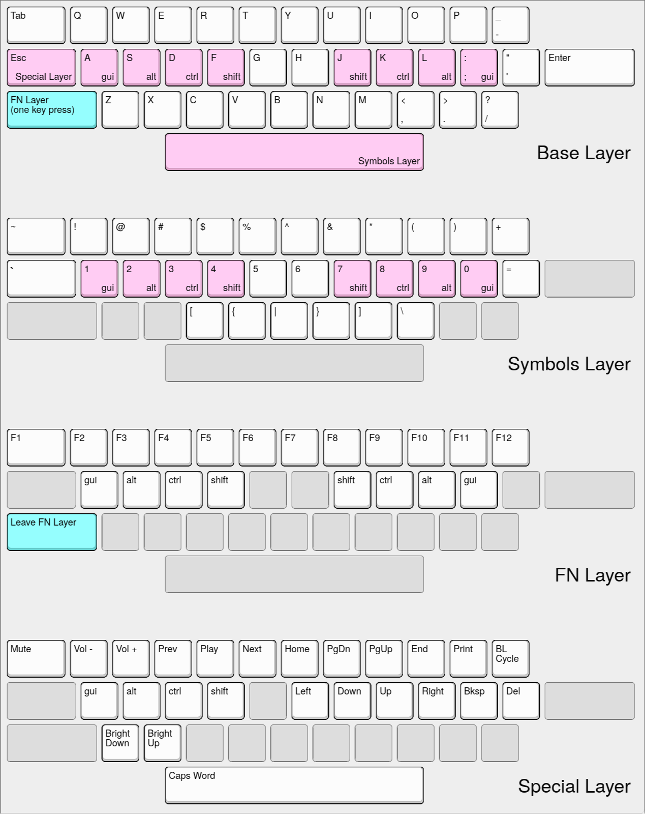

# Skellybones Keyboard

## ANSI Keyboard

Runs a [fork](https://github.com/dev70194/Vial-QMK-for-Framework-16-ANSI) of the official firmware that enables [Vial](https://vial.rocks/) integration. The vial config file can be found [here](./keyboard_vial.json)

This image was generated [here](https://www.keyboard-layout-editor.com/#/) with [this file](./keyboard_layout.json)
`fn+f9` toggles back to a standard QWERTY layout.

## Numpad

Runs the standard firmware which is configured with [via](https://keyboard.frame.work/) with [this](./numpad_via.json) config file
